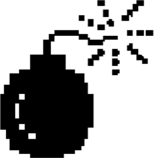

<!-- saved from url=(0045)file:///Users/garrepi/Desktop/garre%CF%80.htm -->

<h3 style="font-weight:bold; font-size:40.0px; font-family:SF Mono;">
HTTP 500
</h3>

If you're seeing this page, <a href="https://www.garrepi.dev">garrepi.dev</a> is down.

Most likely because I am hosting it on a 2010 dell laptop, raspberry pi, or iPhone 7...

It should be back up shortly. If not, you can find the raw markdown of the blog here if you are so inclined to do so:

<a href="https://github.com/johngarrett/garrepi-blog-posts">blog repo</a>  <a href="https://github.com/johngarrett">projects</a>

